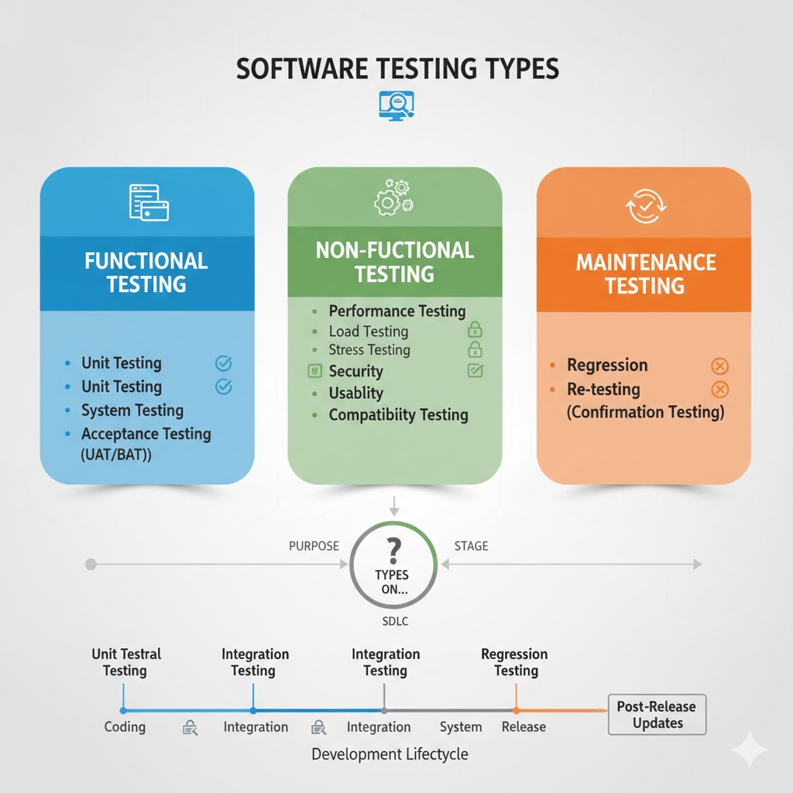

## Part 1: Introduction to Software Testing

Software testing is the process of evaluating a software application to ensure that it behaves correctly, meets business requirements, and remains reliable under different conditions. Testing helps identify defects early, improves code quality, and provides confidence that changes or new features will not break existing functionality. In modern software development, testing is essential because applications often involve multiple layers—controllers, services, repositories, databases, and external integrations—where issues can arise at any point.

At a fundamental level, software testing answers two key questions:

1. Does the software do what it is supposed to do?
2. Does it continue to work correctly when the code changes?

Thorough testing contributes to better maintainability, safer refactoring, and more stable releases. Automated tests, in particular, allow developers to verify functionality quickly and consistently during development, reducing the need for repetitive manual testing.

---

### Why Do We Test Software?

- Ensure functional correctness — features work as intended  
- Prevent regressions when modifying or adding code  
- Improve code structure and maintainability  
- Gain confidence when refactoring complex logic  
- Reduce manual QA effort through automation  
- Build reliable, production-ready applications  

---

### Types of Software Testing (Overview)

Software testing spans multiple levels, each focusing on a different scope of the system. Below is a high-level overview of common testing types:



#### 1. Unit Testing
Tests individual units of code (typically methods or classes) in **complete isolation**.  
- Very fast  
- Automated  
- Uses mocks to simulate dependencies  
- Helps validate business logic early  

#### 2. Integration Testing
Tests how multiple components work together—for example, a controller calling a service which uses a repository.  
- Uses real configurations  
- Slower than unit tests  
- Identifies issues in wiring, data flow, and API behavior  

#### 3. Functional / End-to-End (E2E) Testing
Tests a complete user workflow from start to end.  
Useful for validating behavior from a user's perspective.

#### 4. System Testing
Tests the application as a whole, ensuring all modules function correctly together.

#### 5. Acceptance Testing (UAT)
Conducted by QA teams or business stakeholders to confirm the system meets business requirements.

#### 6. Regression Testing
Ensures that previously working functionality still works after introducing changes or adding new features.

#### 7. Performance Testing
Evaluates speed, responsiveness, and scalability under expected and peak loads.

#### 8. Security Testing
Ensures the application is protected against vulnerabilities such as SQL injection, XSS, authentication flaws, etc.

---

## Focus of This Lesson

This lesson will focus specifically on:

- Unit Testing — writing tests for individual classes or methods  
- Integration Testing — testing REST APIs and component interactions using Spring Boot  

These two testing types form the foundation of a reliable and maintainable Java/Spring Boot backend.

### Types of Software Testing

There are many types of software testing and in this lesson, we will be looking at Unit Testing and Integration Testing.

You can read more here: https://www.guru99.com/software-testing-introduction-importance.html

---

## Part 2: Introduction to Test Driven Development (TDD)

In our usual software development process, developers write code first and then test it. In the TDD approach, developers write tests first and then write code to pass the tests. The tests are written in small increments and the code is refactored after each test.

This approach makes developers think about the requirements and identify any potential issues before writing code.


The TDD cycle follows 3 phases - Red, Green and Refactor.

- Red: Write a test that fails.
- Green: Write the simplest code to pass the test.
- Refactor: Refactor the code to make it better.

For example, in our `simple-crm` project, we might want to unit test that a customer can be created successfully. We would then proceed to write a test for this.

```java
@ExtendWith(MockitoExtension.class)
public class CustomerServiceImplTest {

  @Mock
  private CustomerRepository customerRepository;

  @InjectMocks
  private CustomerServiceImpl customerService;

  @Test
  public void testCreateCustomer() {

    Customer customer = Customer.builder().firstName("Clint").lastName("Barton").email("clint@avengers.com")
        .contactNo("12345678").jobTitle("Special Agent").yearOfBirth(1975).build();

    when((customerRepository.save(customer))).thenReturn(customer);

    Customer savedCustomer = customerService.createCustomer(customer);

    assertEquals(customer, savedCustomer, "The saved customer should be the same as the new customer");

    verify(customerRepository, times(1)).save(customer);
  }

}
```

Following that, we can then write the code to pass this test.

```java
@Service
public class CustomerServiceImpl implements CustomerService {

  @Override
  public Customer createCustomer(Customer customer) {
    return customerRepository.save(customer);
  }

}
```

With the TDD approach, we would write the tests first and then write the code to pass these tests.

Using TDD can result in better code quality and fewer bugs because issues are caught earlier in the development cycle. There is also increased confidence when refactoring code because the tests would catch any issues that may arise. In addition, writing tests first forces developers to think through about the requirements and design of the code before writing it.

However, this approach may not be suitable for all projects because:

- Upfront investment in writing tests: writing tests before code is time consuming, especially for complex requirements and may not be suitable for projects with tight deadlines.
- Learning Curve: developers may be new to this approach and it can take some time to be proficient
- Over-testing: developers may write too many tests and this can be a waste of time and effort
- Maintenance Cost: tests need to be maintained and updated when the code changes, which can be expensive for projects with rapidly changing requirements

Some teams may adopt a hybrid approach where they write tests first for features that have complex business logic and critical components and write tests after for less critical features.

---

## Part 3: Unit Testing

Currently, we test our application by running the application and manually testing the endpoints using Postman. Just calling an API endpoint does not guarantee that the code is working as expected. Because we may have complex logic in our service layer, we need to test the code in our service layer in isolation as well.

For bigger or more complex projects, this can be a problem because every time we make a change to the code, it requires a real person to look at the output and verify that it is correct.

Hence, we should automate our testing process by writing unit tests.

### What is Unit Testing?

Unit testing is a type of software testing where individual units or components of a software are tested. The purpose is to validate that each unit of the software performs as designed. Such tests are also independent of other units and can be run in isolation so that we can test each unit separately.

More importantly, these tests can be performed automatically and are reproduced easily. This is important because we want to be able to run these tests frequently and quickly.

With these tests in place, when we add new features or refactor our code, we can run these tests to ensure that our code is still working as expected. In addition, if team members leave the project, we can be sure that the new team members can run these tests to verify that the code is working as expected.

### Unit Testing Frameworks

We will be using these frameworks for our unit tests:

- [JUnit](https://junit.org/junit5/): a unit testing framework that allows us to create and run unit tests
- [Mockito](https://site.mockito.org/): a mocking framework that allows us to create mock objects for our unit tests

In Spring Boot, these frameworks are included in the `spring-boot-starter-test` dependency.

We use mock objects to simulate the behavior of real objects. This is useful when we want to test a class that depends on another class. Instead of creating an instance of the other class, we can create a mock object that simulates the behavior of the other class. This lets us test our class in isolation.

### Unit Test Example with `@Test`

Let's see a simple example of unit testing. We will use our `simple-crm` code base for this example so that we do not have to create another project.

Create a `DemoService.java`.

```java
public class DemoService {

    public int add(int a, int b) {
        return a + b;
    }

    public int subtract(int a, int b) {
        return a - b;
    }
}
```

We can then create a corresponding `DemoServiceTest.java` class in the `src/test/java` folder.

There are 3 steps in writing a unit test:

1. Setup - Create an instance of the class to be tested
2. Execute - Call the method to be tested
3. Assert - Check the result

This pattern is also known as the **Arrange-Act-Assert** pattern, or **Given-When-Then** pattern.
https://automationpanda.com/2020/07/07/arrange-act-assert-a-pattern-for-writing-good-tests/

We create a method annotated with `@Test` for each test case.

```java
public class DemoServiceTest {

  @Test
  public void testAdd() {
    // 1. SETUP
    // Create the instance of the class that we want to test
    DemoService demoService = new DemoService();

    // Define the expected result
    int expectedResult = 8;

    // 2. EXECUTE
    // Call the method that we want to test
    int actualResult = demoService.add(3, 5);

    // 3. ASSERT
    // Compare the actual result with the expected result
    assertEquals(expectedResult, actualResult, "3 + 5 should be 8");
  }

  @Test
  public void testSubtract() {
    // 1. SETUP
    // Create the instance of the class that we want to test
    DemoService demoService = new DemoService();

    // Define the expected result
    int expectedResult = 2;

    // 2. EXECUTE
    // Call the method that we want to test
    int actualResult = demoService.subtract(5, 3);

    // 3. ASSERT
    // Compare the actual result with the expected result
    assertEquals(expectedResult, actualResult, "5 - 3 should be 2");
  }

}
```

We use assertions to check if the actual result is the same as the expected result. If the actual result is not the same as the expected result, the test will fail.

To run the test, we can click on the green arrow next to the test method. Alternatively, we can type `mvn test` on the terminal.

Let's say we made a mistake in our code, like this:

```java
public int add(int a, int b) {
    return a * b;
}
```

Try to run the test again. You should see that the test fails.

Once you get more familiar with the process, the earlier code could be simplified to:

```java
public class DemoServiceTest {

    @Test
    public void testAdd() {
      DemoService demoService = new DemoService();
      assertEquals(8, demoService.add(3, 5), "3 + 5 should be 8");
    }

}
```

We will be using the longer version for now so that it is easier to understand.

Notice that we are not using dependency injection here. This is because we are testing without spinning up the Spring context. Hence, there are no beans available to be injected. One advantage of doing so is that the test will run faster since it does not involve Spring initialization and container startup.

### Assertions

JUnit has many assertion methods that we can use. Some of the commonly used ones are:

| Method                | Description                                          |
| --------------------- | ---------------------------------------------------- |
| `assertEquals()`      | Checks that two primitives/objects are equal         |
| `assertNotEquals()`   | Checks that two primitives/objects are not equal     |
| `assertTrue()`        | Checks that a condition is true                      |
| `assertFalse()`       | Checks that a condition is false                     |
| `assertNull()`        | Checks that an object is null                        |
| `assertNotNull()`     | Checks that an object is not null                    |
| `assertArrayEquals()` | Checks that two arrays are equal                     |
| `assertThrows()`      | Checks that an exception is thrown by the executable |

You can read more about JUnit assertions [here](https://junit.org/junit5/docs/current/user-guide/#writing-tests-assertions).

### Lifecycle Methods

JUnit also has lifecycle methods that we can use to perform setup and teardown operations. These methods are annotated with `@BeforeAll`, `@BeforeEach`, `@AfterEach` and `@AfterAll`.

| Method        | Description                                                |
| ------------- | ---------------------------------------------------------- |
| `@BeforeAll`  | Executed once before all test methods in the current class |
| `@BeforeEach` | Executed before each test method in the current class      |
| `@AfterEach`  | Executed after each test method in the current class       |
| `@AfterAll`   | Executed once after all test methods in the current class  |

We could move the instantiation of the `DemoService` into the `@BeforeEach` method so that we do not have to repeat the code in every test method.

```java
public class DemoServiceTest {

  DemoService demoService;

  // This method is executed before each test method
  @BeforeEach
  public void init() {
    demoService = new DemoService();
  }
}
```

### Generating HTML Report

You can run `mvn surefire-report:report` and a HTML report will be generated in `target/site/surefire-report.html`.

### 👨‍💻 Activity

Add 3 more methods to the `DemoService` class and write the corresponding unit tests for them.

```java
public int multiply(int a, int b) {
    return a * b;
}

public int divide(int a, int b) {
    return a / b;
}

public boolean isEven(int a) {
    return a % 2 == 0;
}
```

---

## Part 4: Service Layer (Unit Testing)

Recall that the service layer is where we put our business logic. We will be writing unit tests for the service layer.

As the service layer is dependent on the data layer, we will need to mock the data layer using Mockito because we are only interested in testing the service layer i.e. we don't actually want to read and write to the database.

Create a `CustomerServiceImplTest.java` in the corresponding test folder. Note that it is a conventional practice to place test files in the corresponding test folder.

e.g.

File to test:
`CustomerServiceImpl.java` in `src/main/java/sg/ntu/edu/simplecrm/service/`

Test file:
`CustomerServiceImplTest.java` in `src/test/java/sg/ntu/edu/simplecrm/service/`

### Mocking

Mocking is a technique used in unit testing to isolate a class under test from its dependencies.

In our case of testing the service layer, we will mock the repository layer. This means instead of calling the repository layer, we will create a mock object that simulates the behavior of the repository layer.

```java
import org.junit.jupiter.api.Test;
import org.junit.jupiter.api.extension.ExtendWith;
import org.mockito.InjectMocks;
import org.mockito.Mock;
import org.mockito.junit.jupiter.MockitoExtension;

@ExtendWith(MockitoExtension.class)
public class CustomerServiceImplTest {

  // We need to mock the CustomerRepository
  // Because we don't want to test the repository layer
  @Mock
  private CustomerRepository customerRepository;

  @InjectMocks // Inject the mocks as dependencies into CustomerServiceImpl
  CustomerServiceImpl customerService; // Instantiated and injected by Mockito

  // ...
}
```

The `@ExtendWith(MockitoExtension.class)` annotation is used to enable the Mockito extension for JUnit 5. It will automatically initialize the mocks and inject them into the test class.

The `@Mock` annotation is used to tell Mockito to create a mock object for the `CustomerRepository` class.

The `@InjectMocks` annotation is used to tell Mockito to inject the mock object into the `CustomerServiceImpl` class.

With this, we do not have to spin up the entire Spring application context and we can test the service layer in isolation.

### Test Create Customer

Now we can add a test method to test the `createCustomer()` method.

```java
@ExtendWith(MockitoExtension.class)
public class CustomerServiceImplTest {

  // Mock the customer repository
  @Mock
  private CustomerRepository customerRepository;

  // Inject the mocked customer repository into the customer service
  @InjectMocks
  private CustomerServiceImpl customerService;

  @Test
  public void testCreateCustomer() {

    // 1. SETUP
    // Create a new customer
    Customer customer = Customer.builder().firstName("Clint").lastName("Barton").email("clint@avengers.com")
        .contactNo("12345678").jobTitle("Special Agent").yearOfBirth(1975).build();

    // Mock the save method of the customer repository
    when((customerRepository.save(customer))).thenReturn(customer);

    // 2. EXECUTE
    // Call the method that we want to test
    Customer savedCustomer = customerService.createCustomer(customer);

    // 3. ASSERT
    // Compare the actual result with the expected result
    assertEquals(customer, savedCustomer, "The saved customer should be the same as the new customer");

    // Also verify that the save method of the customer repository is called once
    verify(customerRepository, times(1)).save(customer);
  }

}
```

We start with our setup.

- We create a new customer using the builder pattern. To allow that, we add `@Builder` on our `Customer` class. Note that you can also create it using the usual constructor method.
- Then we mock the `save()` method of the `CustomerRepository` to return the customer that is passed in. This is because we want to test the `createCustomer()` method and not the `save()` method of the `CustomerRepository`.
- We can use the `when()` method to tell Mockito what to do when the `save()` method of the `CustomerRepository` is called. In this case, we want to return the customer that is passed in.

Next we execute, which is to call the method that we want to test

- We call the `createCustomer()` method of the `CustomerService` and pass in the customer that we created earlier.

Finally, we assert.

- We assert that the customer that is returned by the `createCustomer()` method is the same as the customer that we created earlier.
- Note that we have to override the `equals()` method in the `Customer` class for this to work. You can use VSCode to do this. Right click on the `Customer` class and select `Generate hashCode() and equals()`. Select all the fields and click `Generate`. Alternatively, we can use the `@EqualsAndHashCode` annotation from Lombok.
- We also verify that the `save()` method of the `CustomerRepository` is called once. This is to ensure that the `createCustomer()` method is calling the `save()` method of the `CustomerRepository`.

### Test Get Customer

```java
@Test
public void testGetCustomer() {
    // 1. SETUP
    // Create a new customer
    Customer customer = Customer.builder().firstName("Clint").lastName("Barton").email("clint@avengers.com")
        .contactNo("12345678").jobTitle("Special Agent").yearOfBirth(1975).build();

    Long customerId = 1L;

    when(customerRepository.findById(customerId)).thenReturn(Optional.of(customer));

    // 2. EXECUTE
    Customer retrievedCustomer = customerService.getCustomer(customerId);

    // 3. ASSERT
    assertEquals(customer, retrievedCustomer);

}
```

### Test Get Customer Not Found

```java
@Test
void testGetCustomerNotFound() {
    Long customerId = 1L;
    when(customerRepository.findById(customerId)).thenReturn(Optional.empty());

    assertThrows(CustomerNotFoundException.class, () -> customerService.getCustomer(customerId));
}
```

---

## Part 5: REST API Test (Integration Testing)

In Unit Testing, we test a small unit of the application. In Integration Testing, we want to test the whole request and response cycle of our application. It will involve all the layers of our application.

How do we test a REST Controller? Spring provides a library called `MockMvc` that allows us to mock HTTP requests and responses. We can use MockMvc to test our REST Controller.

Let's create a `CustomerControllerTest.java` in the corresponding test folder.

We need to annotate it first with `@SpringBootTest`, which will load the Spring application context. This will allow us to test the controller as if it is running in a real Spring application because it will load all the beans and configurations.

We also need to annotate it with `@AutoConfigureMockMvc`, which will autowire the `MockMvc` object. This object is used to perform the HTTP requests.

### Test Get Customer

```java
// This may not be auto-imported
import static org.springframework.test.web.servlet.result.MockMvcResultMatchers.*;

@SpringBootTest
@AutoConfigureMockMvc // This is needed to autowire the MockMvc object
public class CustomerControllerTest {

  @Autowired
  private MockMvc mockMvc;

  @DisplayName("Get customer by Id")
  @Test
  public void getCustomerByIdTest() throws Exception {
    // Step 1: Build a GET request to /customers/1
    RequestBuilder request = MockMvcRequestBuilders.get("/customers/1");

    // Step 2: Perform the request, get the response and assert
    mockMvc.perform(request)
        // Assert that the status code is 200
        .andExpect(status().isOk())
        // Assert that the content type is JSON
        .andExpect(content().contentType(MediaType.APPLICATION_JSON))
        // Assert that the id returned is 1
        .andExpect(jsonPath("$.id").value(1));
  }
}
```

### JsonPath

JsonPath is a library that allows us to query JSON documents. We can use it to query the JSON response returned by our REST Controller.

For example, if we have a JSON response like this:

```json
{
  "id": 1,
  "firstName": "Clint",
  "lastName": "Barton",
  "email": "clint@avengers.com"
}
```

```java
jsonPath("$.id") // returns 1.
jsonPath("$.firstName") // returns Clint.
jsonPath("$.lastName") // returns Barton.
jsonPath("$.email") // returns "clint@avengers.com"
```

### Test Get All Customers

```java
@Test
public void getAllCustomersTest() throws Exception {
    // Step 1: Build a GET request to /customers
    RequestBuilder request = MockMvcRequestBuilders.get("/customers");

    // Step 2: Perform the request, get the response and assert
    mockMvc.perform(request)
            .andExpect(status().isOk())
            .andExpect(content().contentType(MediaType.APPLICATION_JSON))
            .andExpect(jsonPath("$.size()").value(4));
}
```

### Test Valid Customer Creation

To create a customer, we need to send a POST request to `/customers` with a JSON body. In order to do that, we need to convert our Java object to JSON. We can use the `ObjectMapper` class to do that. ObjectMapper is provided by the Jackson library.

```java
@Autowired
private ObjectMapper objectMapper;
```

```java
@Test
public void validCustomerCreationTest() throws Exception {
	// Step 1: Create a Customer object
	 Customer newCustomer = Customer.builder().firstName("Clint").lastName("Barton").email("clint@avengers.com")
        .contactNo("12345678").jobTitle("Special Agent").yearOfBirth(1975).build();

	// Step 2: Convert the Java object to JSON using ObjectMapper
	String newCustomerAsJSON = objectMapper.writeValueAsString(newCustomer);

	// Step 3: Build the request
	RequestBuilder request = MockMvcRequestBuilders.post("/customers")
			.contentType(MediaType.APPLICATION_JSON)
			.content(newCustomerAsJSON);

	// Step 4: Perform the request and get the response and assert
	mockMvc.perform(request)
			.andExpect(status().isCreated())
			.andExpect(content().contentType(MediaType.APPLICATION_JSON))
			.andExpect(jsonPath("$.id").value(5))
			.andExpect(jsonPath("$.firstName").value("Clint"))
			.andExpect(jsonPath("$.lastName").value("Barton"));

}
```

### Test Invalid Customer Creation

```java
@Test
public void invalidCustomerCreationTest() throws Exception {
    // Step 1: Create a Customer object with invalid fields
    Customer invalidCustomer = new Customer(3L, "  ", "  ", "bruce@a.com", "12345678", "Manager", 1990, null);

    // Step 2: Convert the Java object to JSON
    String invalidCustomerAsJSON = objectMapper.writeValueAsString(invalidCustomer);

    // Step 3: Build the request
    RequestBuilder request = MockMvcRequestBuilders.post("/customers")
            .contentType(MediaType.APPLICATION_JSON)
            .content(invalidCustomerAsJSON);

    // Step 4: Perform the request and get the response
    mockMvc.perform(request)
            .andExpect(status().isBadRequest())
            .andExpect(content().contentType(MediaType.APPLICATION_JSON));
}
```

---

END